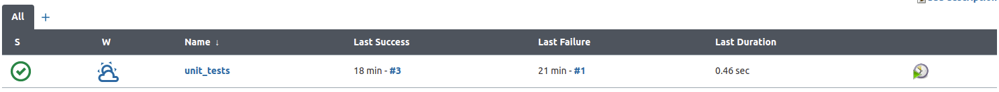
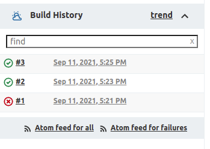
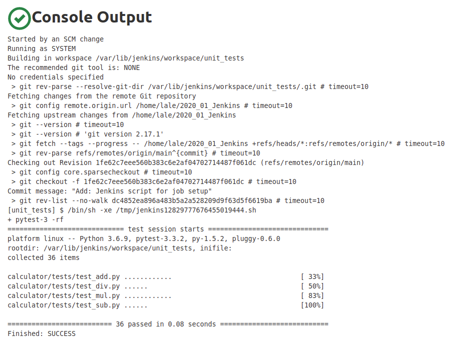

# Jenkins testing :wrench:

## O projektu :nerd_face:

Projekat je rađen u okviru kursa <b>_Verifikacija softvera_</b> na master studijama 
smera informatike na Matematičkom fakultetu u Beogradu.


Cilj projekta je podizanje Jenkins posla koji prati stanje na gitu i prilikom
detektovanja izmena (tj. novog komita) automatski testove.

## Preduslovi

### Podizanje Jenkins servera :bug:

Ubuntu:

```
wget -q -O - https://pkg.jenkins.io/debian-stable/jenkins.io.key | sudo apt-key add -
sudo sh -c 'echo deb https://pkg.jenkins.io/debian-stable binary/ > \
    /etc/apt/sources.list.d/jenkins.list'
sudo apt-get update
sudo apt-get install jenkins
```

Više informacija: https://www.jenkins.io/doc/book/installing/linux/

### Python paketi :snake:

Ubuntu (18.04):

```
pip3 install python-jenkins
pip3 install coverage

sudo apt install python3-pytest
```

## Pokretanje :rocket:

Podizanje Jenkins zadatka koji prati stanje na gitu može se izvesti 
pomoću skripte: `jenkins_scripts/setup_testing_job.py`

Parametri skripte:
```
--project-path: Apsolutna putanja do git projekta
--branch: Grana koju ce Jenkins posmatrati
--jenkins-address: Adresa na kojoj se Jenkins nalazi
--jenkins-user: Nalog koji kreira Jenkins zadatak
--jenkins-pw: Sifra nalog
--job-name: Ime zadatka koji se kreira
```

Ukoliko već postoji zadatak sa istim imenom, novi neće biti kreiran.

# Primer

Nakon pokretanja skripte pojaviće se _Job_ u listi.



Prva kolona predstavlja status poslednjeg testiranja. <br/>
Druga kolona predstavlja agregiran prikaz nekoliko prethodnih izvršavanja. <br/>

Nakon svakog komita pokreću se testovi i oni se mogu videti u istoriji izvršavanja.



Kada izaberemo Job (unit_tests) pa uđemo u konkretan build (#3), možemo
videti izlaz iz konzole.



# Autor
Lazar Jovanović 1099/2019